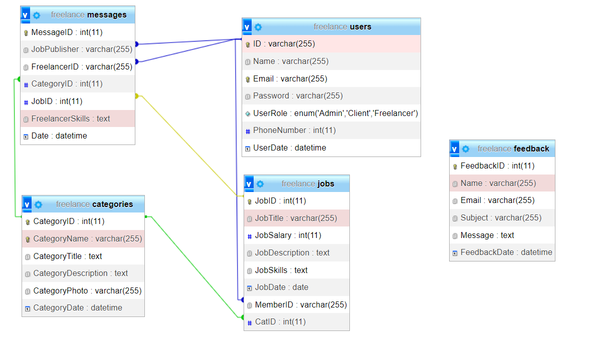

<h1>Freelance System</h1>

<h2>A lot of work can be done remotely these days, so your dreams of working
from your couch can come true by developing a freelance program to
manage all of these.</h2>

<h2>The technologies that were used in the project are HTML | CSS | JS | PHP | MySQL</h2>

<h2>🕸️ Link Site: http://freelanceweb.rf.gd/main.php</h2>

<h3>There are three users, Administrator, Client, and Freelancer</h3>

<h3>⭐ Administrator ⭐</h3>
<h4>-- Perform CRUD on all users, categories and jobs.</h4>
<h4>-- View and delete messages and feedbacks received from users.</h4>

<h3>⭐ Client ⭐</h3>
<h4>-- Perform CRUD in all its jobs.</h4>
<h4>-- View and delete messages received from users.</h4>

<h3>⭐ Freelancer ⭐</h3>
<h4>-- Apply for jobs by submitting his skills.</h4>
<h4>-- He is accepted for a job, he will be contacted via the WhatsApp number he entered when creating the account.</h4>

<h3>❗ All Users can modify his personal data or delete the private account.</h3>
<h3>❗ When the account is created, the user cannot create an administrator account, only administrators can add administrators</h3>

<h3>Relationships between tables ⬇️</h3>

